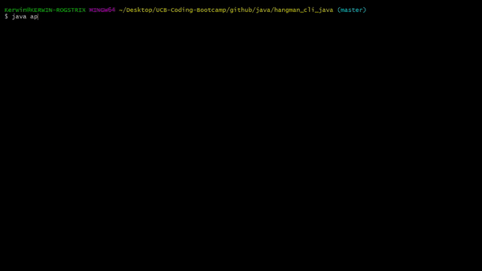

# CLI Hangman (Java Edition)
**Technologies Used:** Java

## Summary
A hangman game created by using class constructors for a Word that stores an ArrayList of class constructors for individual characters. The classes contain methods and properties to determine whether a user has successfully guessed all the letters in a word.

## Highlights:
- Class Constructors
- User Input for Guessing
- Randomly picks a word stored in a txt file

## Installation Guide
- Clone this Repository to your computer
- Navigate to the cloned directory on your computer in terminal/console
- Run: java app.java

## Dependencies
- Java JDK 8

## Learning Experience
- Learned to read from a file
- Learned to write class constructors
- Learned to use a class constructor inside a class constructor
- Input validation

## Demo Gifs
bamazonCustomer<br>


## Code Snippets
>Class Constructor: Word
```
static class Word {
  ArrayList<Letter> letters = new ArrayList<Letter>();
  String guesses = "";
  int remainingGuesses = 10;
  String fullWord;

  public Word (String newWord) {
    createWord(newWord);
    fullWord = newWord;
  }

  public void printWord() {
    String word = "";
    for (int i = 0; i < letters.size(); i++) {
      word += letters.get(i).printLetter() + " ";
    }
    System.out.println(word);
  }

  public void createWord(String word) {
    for (int i = 0; i < word.length(); i++) {
      Letter temp = new Letter(word.charAt(i));
      letters.add(temp);
    }
  }

  public void guessLetter(char letter) {
    if (fullWord.indexOf(letter) == -1) {
      remainingGuesses -= 1;
    }
    for (int i = 0; i < letters.size(); i++) {
      letters.get(i).guessLetter(letter);
    }
  }

  public boolean checkWord() {
    for (int i = 0; i < letters.size(); i++) {
      if (letters.get(i).revealed == false) {
        return false;
      }
    }
    return true;
  }
}
```

>Class Constructor: Letter
```
static class Letter {
  char letter;
  boolean revealed = false;

  public Letter(char userInput) {
    letter = userInput;
    if (letter == ' ' || letter == '\'' || letter == '-') {
      revealed = true;
    }
  }

  public char printLetter() {
    if (revealed == true) {
      return letter;
    } else {
      return '_';
    }
  }

  public boolean guessLetter(char guess) {
    if (guess == letter && revealed == false) {
      revealed = true;
      return true;
    }
    return false;
  }
}
```

## Links
LinkedIn: https://www.linkedin.com/in/kerwinhy/<br>
GitHub: https://github.com/seiretsym<br>
